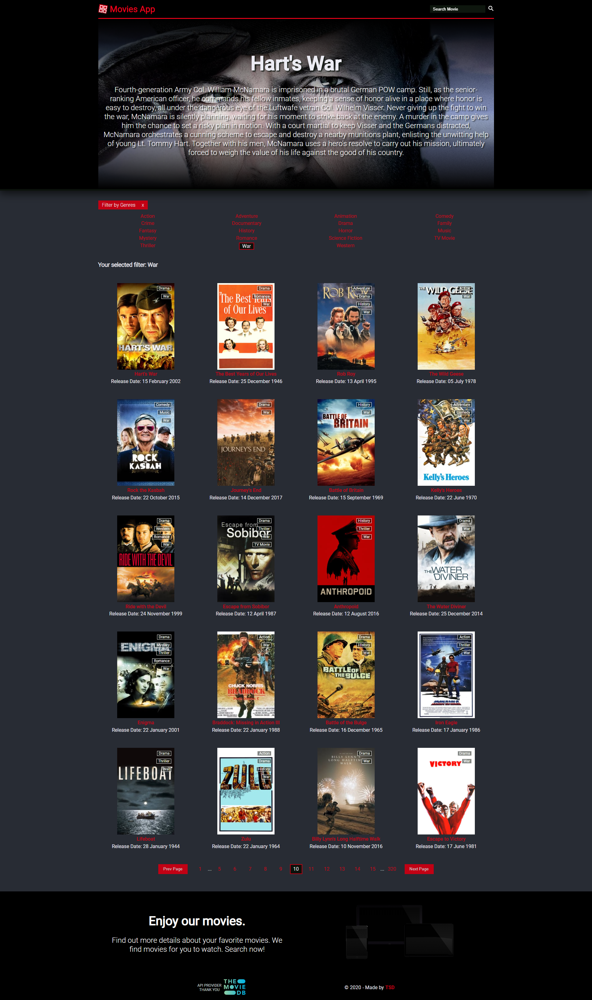
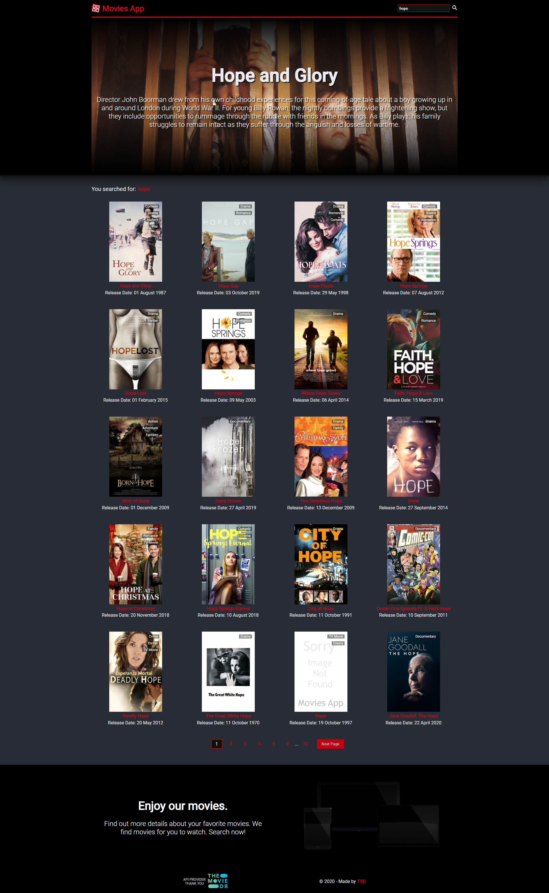
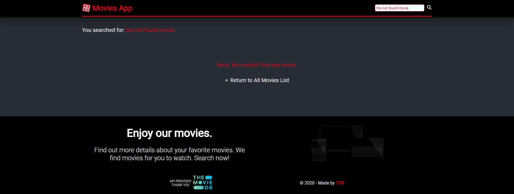

# Movies App - 2020

**A library of movies.**



## Description

Movies App built in React ^16.13.1 which will display all movies from [The Movie Database API](https://www.themoviedb.org/) and all the details about each movie.
The user can either filter all the movies by genres or use the search field to find a specific movie.
Has a custom pagination which will fetch a different endpoint for each functionality, either on load, Search results or Genres filter.

**I used:**

- React (mainly functional components and hooks)
- React Router
- FetchAPI
- Styled Components
- PropTypes

### Api Key:

Get an api key from [TMDB Api](https://www.themoviedb.org/documentation/api)
Create an .env.local file in the root of the project and put your API key.
**Example of .env file:**
REACT_APP_API = yourapikey

#### Installation Npm - npm install

```
`npm start` - Runs the app in the development mode.
`npm build` - Builds the app for production to the `build` folder.
`npm test` - Launches the test runner in the interactive watch mode.
```

#### Installation Yarn - yarn install

```
`yarn start` - Runs the app in the development mode.
`yarn build` - Builds the app for production to the `build` folder.
`yarn test` - Launches the test runner in the interactive watch mode.
```

**_Enjoy, Stefan 🚀🚀🚀_**

##### Other Images



